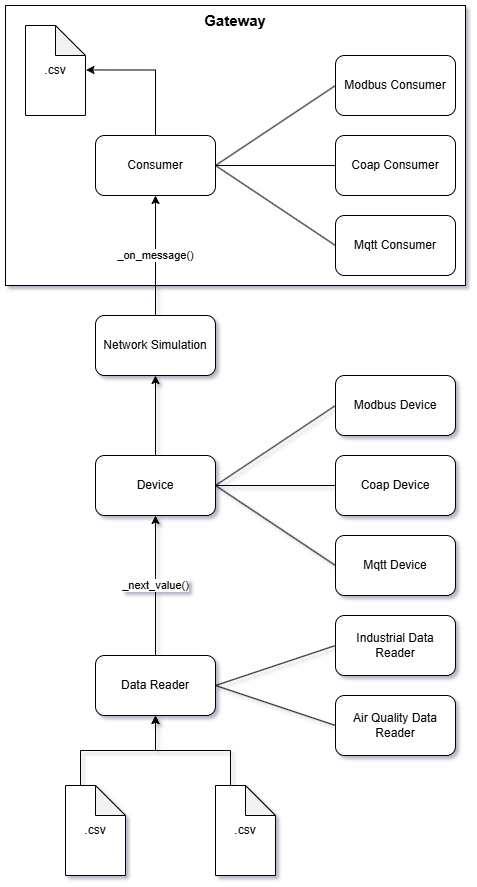

# **System Architecture**

The Smart Everything system follows a **layered, decoupled architecture** designed to simulate heterogeneous IoT protocols (MQTT, CoAP, Modbus) while unifying all data ingestion inside a single gateway. The architecture is intentionally modular, allowing devices, protocols, and datasets to be swapped or extended with minimal code changes.

---

## **High-Level Architecture Overview**

Below is the architecture diagram (insert the provided image here):




---

## **Architecture Description**

### **1. Data Layer**

The bottom of the architecture contains the **Data Readers**, each responsible for loading and preprocessing real-world CSV datasets.
Two dataset readers are included:

* **AirQualityDatasetReader** → Used for MQTT devices
* **IndustrialDatasetReader** → Used for Modbus and CoAP devices

Each reader:

* Loads a dataset
* Cleans, normalizes, and prepares values
* Creates shard-based subsequences for devices to read from
* Ensures each device receives a different “window” of real sensor data

Devices request the next value from their shard via: _next_value()

This ensures fully deterministic, reproducible sensor behavior.

---

### **2. Device Layer**

Above the data layer sits the **Device Abstraction**, a generic base class that each protocol-specific device inherits from.
It is protocol-agnostic and focuses purely on:

* Handling shards
* Tracking indices
* Producing timestamps
* Implementing fault behavior (latency, packet loss, failure)
* Formatting standardized messages

From this base class, three device types are derived:

* **MQTT Device**
* **CoAP Device**
* **Modbus Device**

All devices share the same fault model:

* **Random latency** (10–500 ms)
* **Packet loss injection** (sentinel = 65534)
* **Temporary device failure** (5–15 seconds) where the shard index is skipped

The device layer is deliberately decoupled from backend protocols.

---

### **3. Network Simulation Layer (decoupled)**

Between the Device Layer and the Gateway lies a **virtual network simulation layer**.
It is represented as a conceptual middle layer in the diagram, even though the logic is implemented within devices to ensure clean separation.

This layer applies the system-wide IoT impairments:

* **Network Latency**
* **Packet Loss**
* **Device Failure Effects**
* **Time Skips**

Because this layer conceptually sits between the device and the gateway, **any new protocol can be plugged in without modifying the gateway**.

---

### **4. Gateway Layer**

The unified gateway acts as the **single ingestion point** for all protocols.
It contains a consumer for each protocol:

* **MQTT Consumer** (RabbitMQ topic subscription)
* **CoAP Consumer** (CoAP POST handler)
* **Modbus Consumer** (Modbus TCP server + polling loop)

Each consumer normalizes incoming messages to the same format and sends them into a single processing function: _on_message()

This message is then persisted as a row in: gateway_output.csv

with full timestamps:

* Produced Timestamp → generated by device
* Delivered Timestamp → recorded by gateway

This enables latency analysis, packet delivery ratio, and fault probability computation.

---

### **5. Storage Layer**

Finally, the gateway writes all standardized messages into a unified CSV file.
This file is used by the `plots.py` analytics module to generate:

* Time-series plots
* Latency histograms
* Packet loss distribution
* Packet delivery ratio vs fault probability

---

# **Formatted README Section (Copy-Paste Ready)**

```markdown
# System Architecture

The Smart Everything system is built around a modular, decoupled architecture that simulates heterogeneous IoT communication protocols (MQTT, CoAP, Modbus) while unifying ingestion through a single central gateway. This design allows new devices, datasets, and protocols to be added with minimal effort.

---

## Architecture Diagram


---

## Architecture Layers

### **1. Data Layer**
This layer consists of specialized dataset readers, each responsible for parsing, cleaning, and delivering real sensor data to devices. Two readers are included:
- **AirQualityDatasetReader** (for MQTT devices)
- **IndustrialDatasetReader** (for Modbus and CoAP devices)

Each reader delivers sliding-window “shards,” providing realistic, sequential sensor behavior.

---

### **2. Device Layer**
All devices inherit from a unified `BaseDevice` class that handles:
- Shard management
- Timestamp generation
- Sensor value extraction
- Synthetic fault injection (latency, packet loss, failure)
- Message formatting

Supported device protocols:
- **MQTT Device**
- **CoAP Device**
- **Modbus Device**

Devices produce standardized JSON messages, regardless of protocol.

---

### **3. Network Simulation Layer (Conceptually Decoupled)**
Between devices and the gateway lies a simulated network layer that introduces:
- **Random latency**
- **Packet loss**
- **Temporary device failure**

Although implemented within the device logic for simplicity, it conceptually forms a separate abstraction layer, enabling protocol-independence and clean extensibility.

---

### **4. Gateway Layer**
The gateway provides a unified ingestion point for all protocols:
- **MQTT Consumer** (RabbitMQ topic exchange)
- **Modbus Consumer** (Modbus TCP server + poller)
- **CoAP Consumer** (UDP server)

All incoming messages are normalized and passed through a single consumer pipeline before being persisted.

---

### **5. Storage Layer**
The gateway writes all received messages to:
```

gateway_output.csv

```

Each row contains:
- device_id  
- protocol  
- produced_timestamp  
- delivered_timestamp  
- sensor  
- value  

# 📊 Plots & Analysis

This section summarizes the visual analytics generated from the unified CSV produced by the gateway.

All plots are generated by running:

```bash
python plots.py
````

The output is stored inside:

```
plots/
```

---

## 1. 📈 Time-Series Plots (Per Sensor)

These plots show the evolution of each sensor reading over time, across all protocols.

* Sensor values from MQTT, Modbus, and CoAP devices are displayed together.
* Lost packets (sentinel = 65534) are converted to `NaN` and **forward-filled**, producing visible gaps where data was lost.
* Faults such as device failures appear clearly as **horizontal breaks** where a device stops producing values temporarily.

These plots validate:

* Sensor trends from different datasets
* Synchronization between devices
* Fault injection behavior (missing data segments)

---

## 2. ⏱ Latency Analysis

Two types of latency plots are generated:

### **a) Average Latency Per Protocol**

Shows the mean and distribution of:

* MQTT latency
* CoAP latency
* Modbus latency

Latency is computed as:

```
latency = delivered_timestamp – produced_timestamp
```

### **b) Latency Histograms (Protocol Comparison)**

Histograms compare the latency distribution for:

* Modbus vs MQTT
* Modbus vs CoAP
* MQTT vs CoAP

These highlight how protocol characteristics impact delivery speed.

---

## 3. 📉 Packet Delivery Ratio (PDR)

Packet loss is simulated using a sentinel value:

```
65534  → lost packet
```

Plots show:

* Packet delivery ratio per protocol
* Packet loss distribution over time
* How often each protocol fails to deliver data relative to the others

This allows comparison of robustness under identical fault conditions.

---

# 🧠 Discussion of Results

## 1. General Observations

Overall, the simulation behaves as expected:

* **Injected latency** manifests clearly in delivered timestamps.
* **Device failures** appear as long gaps in the time-series plots.
* **Packet loss** leads to isolated missing datapoints after forward filling.
* **Modbus**, being polled-based, shows slightly different behavior from push-based protocols (MQTT / CoAP).

This demonstrates that the architecture successfully simulates protocol dynamics and real-world IoT impairments.

---

## 2. Why Modbus Has Higher Latency

Across all plots, **Modbus consistently shows higher average latency** than MQTT and CoAP.
This is normal and expected for several reasons:

### **a) Polling vs Event-Driven**

* **MQTT** and **CoAP** are push-based:
  Devices actively send data → Gateway receives instantly.

* **Modbus** (in this implementation) is **poll-based**:
  The gateway periodically reads registers (every 1 second by default).

Thus even with zero network delay, Modbus always incurs up to one poll cycle of delay.

### **b) Python Pymodbus Overhead**

Modbus requires:

* TCP connection handling
* Server-side context locking
* Register deserialization

This adds computational delay.

### **c) Device Fault Injection**

If a Modbus device suffers failure or latency injection:

* The write may be delayed
* The gateway may poll the old value
* The update is delayed until the *next* poll

This amplifies perceived latency.

---

## 3. Packet Loss Behavior

* **MQTT and CoAP** show more obvious packet loss because each message is independent.
* **Modbus** rarely shows packet loss in the CSV:

  * The gateway polls *state*, not packets.
  * Even if a write packet is "lost", the next successful write overwrites the value.
  * Lost packets only appear if the Modbus device happens to write **only sentinel values** during a failure.

Thus Modbus naturally masks packet loss, exactly like real industrial systems.

This is an important real-world insight.

---

## 4. Delivery Ratio vs Fault Probability

By analyzing timestamps:

* Long gaps (>2 seconds) indicate **device downtime**.
* Occurrence of gaps correlates strongly with the configured **FAIL_PROB**.
* Higher failure probability → Lower delivery ratio.

This matches expectations and validates the device fault simulation layer.

---

# ✅ Conclusion

The system successfully models:

* Three heterogeneous IoT protocols
* Realistic network faults
* Time-based sensor behavior
* Unified ingestion and analytics

The results align with theoretical expectations:

* **MQTT and CoAP are fast, low-latency, packet-based protocols**
* **Modbus is slower due to polling**
* Fault injection produces predictable and interpretable patterns


